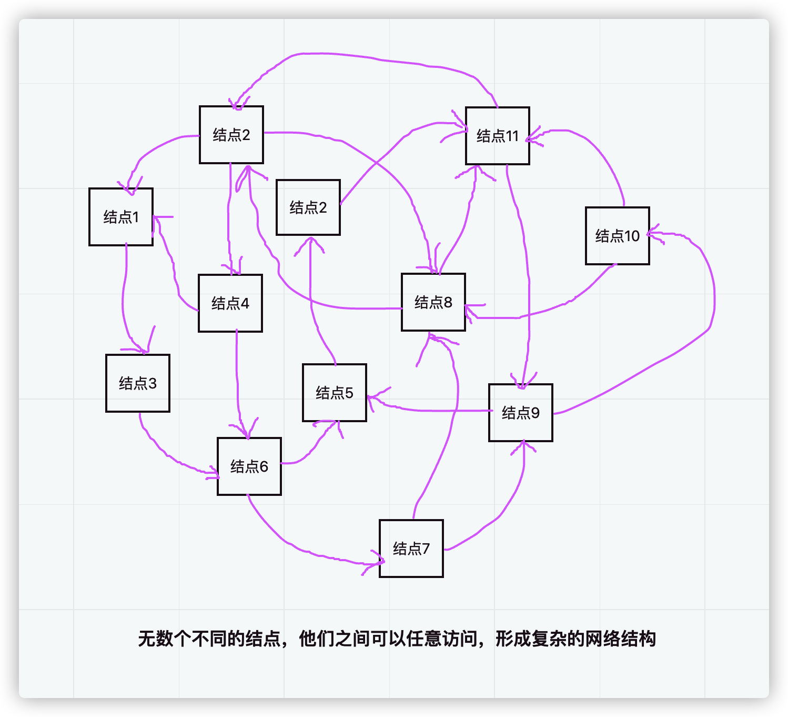
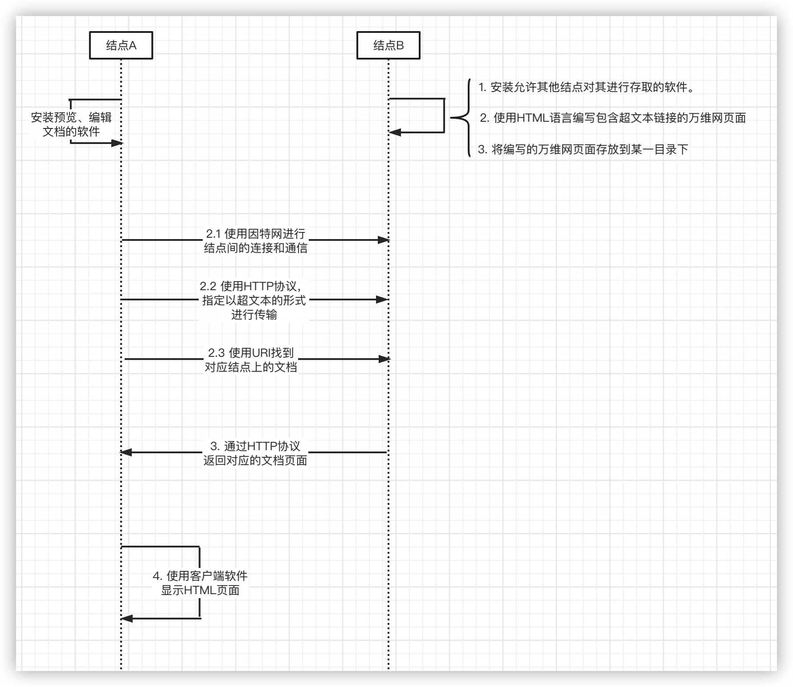

# 第三章 万维网

在开发完Enquire程序后，发生了一些小插曲。先是蒂姆离开了CERN，过了一段时间后，就又回来了。

此时，CERN有新的粒子加速器建成，与之对应的是，计算的复杂性也相应的增加。新一代的计算机、操作系统和编程语言，以及连接那些支撑大型实验的诸多计算机
的各种不同的网络协议，都已经投入使用。

来自IBM公司、数字设备公司和数据控制公司的机器，在CERN应有尽有。还有个人计算机公司和不同的字处理机
公司所提供的PC机或Mac机。

同时，科学家们带着他们的机器和习惯到来，而所有其他人必须尽可能的适应他们。然后这些小组回到他们自己的国家，
尽管他们分散在不同的时区和使用不同的语言，但他们仍必须相互合作。

概括来说，CERN是一个很复杂的团体，它的现状是：

```
    1. 有大量的不同型号、操作系统、软件的计算机。而且他们之间存在需要相互共享资源的需求。
    2. 对来自世界各地的人员的信息和相应匹配资源信息的管理
    3. 不同的人员会针对同一问题向相关人士询问多次，而相关人士需要重复回答多次。
    4. …………
```

解决CERN内部问题的思路，可谓跟之前蒂姆思量的更大范围（全球互联）的想法异曲同工。

假设在CERN内部形成一个网络，而这个网络是由许许多多个结点组成。每个结点可以是独特的个体
（可以是不同型号的设备、操作系统和软件），他们允许结点自由的访问其他结点上的资源，这些
资源可以是文档、图片、或者是其他等类型。以此类比，把它扩展到全球范围内，是不是就能实现
全球互联，人们可以平等、自由的获取到他们感兴趣的任何资源呢？

这无疑激发了蒂姆的热情，并首先从解决CERN内部遇到的问题开始。

他是怎么做的呢？

+ 首先，蒂姆经过仔细考量，最终决定选用因特网来实现不同计算机之间的通信。这样当无数个计算机之间彼此不限制的连接时，形成了一个巨大的网络结构。
  
+ 然后，再构思任意两个结点具体是怎么沟通的：
  

  + 如图所示，结点A想要获取结点B上的一个文档。其中结点A、B就分别充当了客户端、服务端的角色。
  + 第一步，需要开发一个客户端程序，它是用来预览和编辑超文本文档的。也被叫做"浏览器"
  + 同时，需要开发一个服务端程序，使得该计算机充当服务器的角色。同时需要一种语言，来编写超文本页面。而这个语言就是HTML
  + 第二步，使用因特网先连接两个计算机。紧接着他们需要一种协议，以用来传输超文本。这就是HTTP协议，同时需要一个寻址的方案来找到对应的文档。这就是URI（统一资源识别器）
  + 第三步，作为服务器的结点B，在找到对应的文档后，通过HTTP协议把它返回给结点A。
  + 第四步，结点A在接收到对应的文档后，通过浏览器把它显示出来。
  + 就这样，完成了一次沟通。

这样构成的一个网络，蒂姆就把它成为万维网（World Wide Web）。

紧接着，一个关键的时刻就来临了。

**1990年的圣诞节时，那个WorldWideWeb 浏览器/编辑器开始在蒂姆和罗贝尔的机器上运行，并借助`info.cern.cn`服务器在因特网上通信。—— 万维网就正式出现在人们的视野中！**
