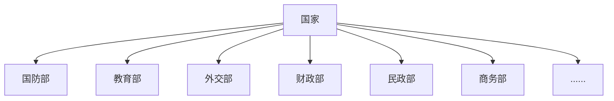
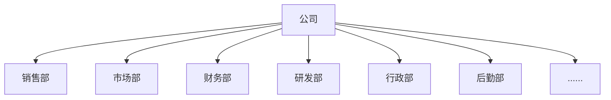

不知道大家有没有这样的体验，小时候盼望着长大，幻想着能自由自在的去做想做的事。于是，就拼命的去追寻、努力……在这个过程中，我们流过泪、也被绊倒过，但是只要挺住，过去后，就会迈入新的台阶。

当我们回首过去时，会发现之前的种种只不过是 `成长的烦恼` 而已。

Web也在成长，当然了不可避免的就会有 `成长的烦恼`。

#### 1. “该怎么改善，越来越复杂的动态HTML变更？”

我们前面提到，有了AJAX技术后，Web应用的设计方式就变成了：

> - 后端：仅仅是提供一套API，返回需要的JSON数据。
> - 前端：拿到后端返回的数据后，动态的生成HTML模版，然后进行渲染，最终显示在页面上。

如果是比较简单的应用，前端的工作还不算什么。但是经不住业务复杂度直线的上升，此时我们的开发就可能会是（哪怕是使用jQuery这类的能简化开发的库）：

-   首先，我们需要事先维护多套模版，它可能是多个文件抑或是几个大的字符串。并且每个模版中会有多个地方需要动态的变更数据。

-   然后我们需要对用户的操作进行事件绑定。

-   当触发事件后，我们会使用AJAX向服务端请求数据。

-   紧接着，服务端返回数据后，需要把这些数据，放到对应的模版中，怎么放呢？可能会先获取之前定义好的模版，然后通过一定的规则去匹配，找到后对其赋值。这里面也能会涉及到一些复杂的逻辑。

-   最后再把赋值后的内容，渲染进真实的DOM中。

-   ……

大家想一下，一旦业务复杂度上来了，光这块模版的维护、赋值、渲染就会很复杂，甚至还很容易出Bug。让人头痛不已。

“哎😮‍💨😮‍💨😮‍💨，我好烦恼呀！”

没关系的呢，为了改善这个过程的复杂程度，这不就有了 `JavaScript模版引擎` 嘛。

****JavaScript模版引擎****

它的原理简单来说就是，`模版引擎会作为模版和数据的桥梁，它通过编译把两者组织在一起，生成最终的HTML代码`。当然了模版引擎会在底层自己去做这些事，对外暴露的都是简单的调用形式。

当时，像比较流行的有：`Mustache`、`Underscore`中的模版引擎、`Handlebars`等。

（额外说一下，像现在比较流行的前端框架Vue.js，其中的 `{{ }}` （双大扩括号）的写法就是采用 `Mustache`模版引擎的书写方式）

这样的确是大大简化了我们的编码！我们只需要一开始定义好模版，并且取到相应的数据，然后把它们给到模版引擎，剩下的我们就不用管了。同时，模版引擎还提供预编译的功能，提高了模版使用的整体性能。

#### 2. “对于大型项目，该怎么提高代码的可维护性？”

有了JavaScript模版引擎后，前端代码的逻辑变得更清晰了。但还是面临着严峻的考验，那就是对于大型项目，该怎么能让它结构清晰、代码更具稳定性、可维护性呢？

这绝对是一个颇具挑战性的问题。

而在众多的解决方案中，就出现了一个让人眼前一亮的：`MVC模式`

刚开始看到 `MVC`，是有种熟悉的感觉的。是因为我之前有开发过Java，所以对MVC不可能不知道。我当时还在想一个后端的东西居然要拿到前端来用，可以吗？好用吗？

事实证明，MVC是一种软件设计模式，它更多体现的是一种设计思想，而不是局限于某一端、某一类编程语言。

（接下来我就用自己的理解去尝试解释一下MVC，因为我能力有限，说的不好或有错误的地方还望大家谅解和指出）

我在思考，对于一个复杂的事物或者是庞大的系统，该怎么去维护（或者说是“运转”、“治理”）它呢？我喜欢从现实世界中寻找思路。

**a. 一个国家**

它可谓算是一个巨大的系统了。那它是怎么治理的呢？我发现，它算是这么一个结构：

如图所示，它下面可以划分成**多个专属某一职责的部门。** 然后每个部门各司其职，进而使得整个国家能正常运转。并且它们之间不是割裂的。

比如说，现在我们和别的国家，发生了军事冲突。首先是国防部会发言，表明我们在军事方面的立场；同时它还会跟外交部来联系，说明情况。以便后续外交部回复各国媒体。紧接着，如果要有军事行动的话，那么财务部会向国防部拨款，予以经济方面的支持等。

**b. 一个公司**

如图所示，一个公司可能由：销售部、市场部、财务部等部门组成，他们共同维护着整个公司的正常运转。比如，公司要推出一款产品。可能的步骤是：

-   市场部先去调研产品需求，并制定产品方案。

-   公司根据产品方案，申请对应财务预算（财务部），以及相应的人力（人力资源部）、其他的资源（后勤部）。

-   然后再把它交给研发部，负责产品的研发。

-   研发完成后，把产品交给市场部，市场部再去根据之前的营销方案把它推入市场。

-   而销售部会具体负责产品的销售。

他们分工明确，又相互配合着……

同样的，那么对于一个软件项目，如果也把它按照一定的标准划分成不同的组成部分，让他们相互配合着，然后再完成各自的职责，那么这个系统是不是就可以像一个国家、公司正常、高效、长久的运转下去呢？

对此，我看到了MVC的软件设计模式跟上述例子有异曲同工之处。

而再站到前端的立场来看，后端MVC是很早就出现了，并且它是能应对大型、复杂的项目的！那么何不借鉴一下呢？

…………

所以后面，就有了前端的MVC设计模式。这的确再一定程度上解决了一些问题，让前端也能应对、稳定的支持大型项目了！

成长之路，遇到烦恼再所难免！对此只要我们积极面对，寻找解决方案，那么它总会过去的。而一旦迈过去后便是坦途，我们因此也会变得“更大”、“更强”。
